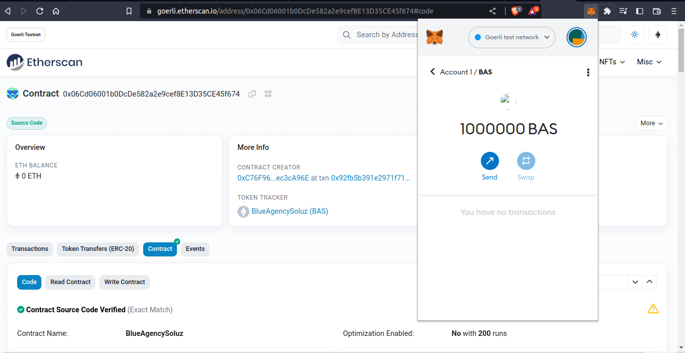
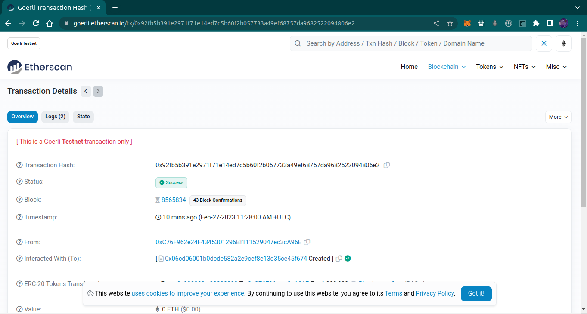

# BlueAgencySoluz Token

- An ERC20 Token for the BlueAgency Soluz Ecosystem

BAS Token was created with Total supply of 1,000,000 and deployed to the goerli testnet.

## Sample Output I

The token was deployed using the goerli testnet and was added to metamask using the address of the deployed contract.

## Sample Output II

## Token Contract Address:

0x06Cd06001b0DcDe582a2e9cef8E13D35CE45f674

## Token EtherScan Address:

https://goerli.etherscan.io/address/0x06Cd06001b0DcDe582a2e9cef8E13D35CE45f674#code
